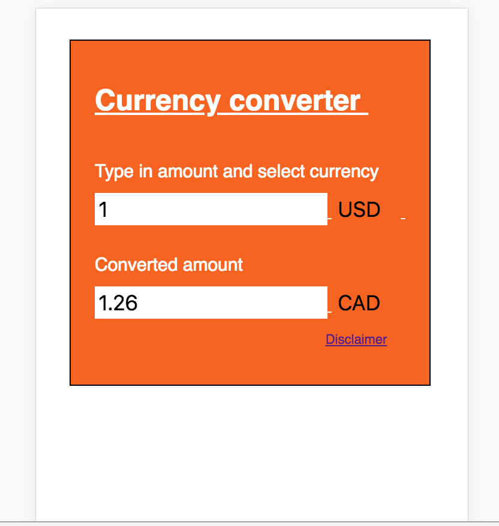

# Currency Converter POC

## Features:

- Angular 5
- ES6
- Typescript
- Webpack

#### Development setup

1. `Download and install Node and NPM Package manager`

2. `Checkout location (git clone https://github.com/ruthra1234/currency-converter.git)`

3. `npm install`

4. `npm start`

5. `http://localhost:4200/`

## Mobile View :

## Browser :

